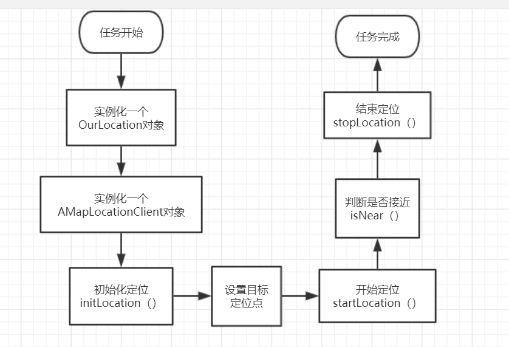
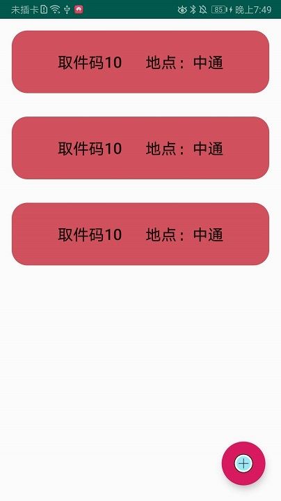
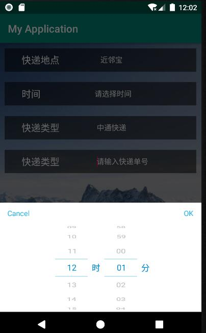

# 快递组第二次迭代文档
## 主要代码
### 位置接口
#### 使用条件
预先导入高德定位SDK，已放入文件夹中
#### 使用方法
1. 定义一个OurLocation类，并实例化，需要传入当前活动上下文  
`public OurLocation myLocation = new OurLocation(MainActivity.this);`   
2. 定义一个地图管理类AMapLocationClient，并实例化  
```Java
public AMapLocationClient mapLocationClient = null;
mapLocationClient = new AMapLocationClient(this.getApplicationContext());
```
3. 初始化定位   
`myLocation.initLocation(mapLocationClient);`  
4. 开始定位  
`myLocation.startLocation();`  
5. 结束定位  
`myLocation.destroyLocation();`  
6. 暂停定位  
`myLocation.stopLocation();`  

#### 拓展方法
1. 设置目的定位点（到时候应该是我们预先导入）  
`myLocation.setLocation(30.539110423443365,114.3586011007117);`  
2. 判断是否接近预置点，返回布尔值  
`myLocation.isNear()`  

#### 实例代码
```Java
public class MainActivity extends AppCompatActivity implements OnClickListener{

    private Button button;

    public OurLocation myLocation = new OurLocation(MainActivity.this);
    public AMapLocationClient mapLocationClient = null;

    @Override
    protected void onCreate(Bundle savedInstanceState) {
        super.onCreate(savedInstanceState);
        setContentView(R.layout.activity_main);
        button = findViewById(R.id.button);
        button.setOnClickListener(this);
        mapLocationClient = new AMapLocationClient(this.getApplicationContext());
        myLocation.initLocation(mapLocationClient);
        myLocation.setLocation(30.539110423443365,114.3586011007117);
    }


    @Override
    protected void onDestroy(){
        super.onDestroy();
        myLocation.destroyLocation();
    }

    @Override
    public void onClick(View view){
        switch (view.getId()){
            case R.id.button:
                myLocation.startLocation();
                break;
        }
    }
}
```
## 代码流程图


## UI界面设计
### 快递提醒界面
 


主区域显示快递提醒信息，右下角悬浮按钮可以新增快递提醒
### 快递设置界面
 


该界面可设置快递提醒的相关信息，如快递点、快递单号、快递类型、提醒时间等
## 小组分工
徐嘉坤：接口编写工作、快递提醒界面设计、文档书写工作 


马润：定位函数、距离判断函数编写、快递设置界面设计 
## 后期进展
1. 快递提醒界面的listview动态下移
2. 设置界面和提醒界面相互关联（暂未绑定活动）
3. 考虑使用数据库（因为当前阶段测试用例较少，未采用数据库）
4. 程序性能的优化
5. UI界面的统一
