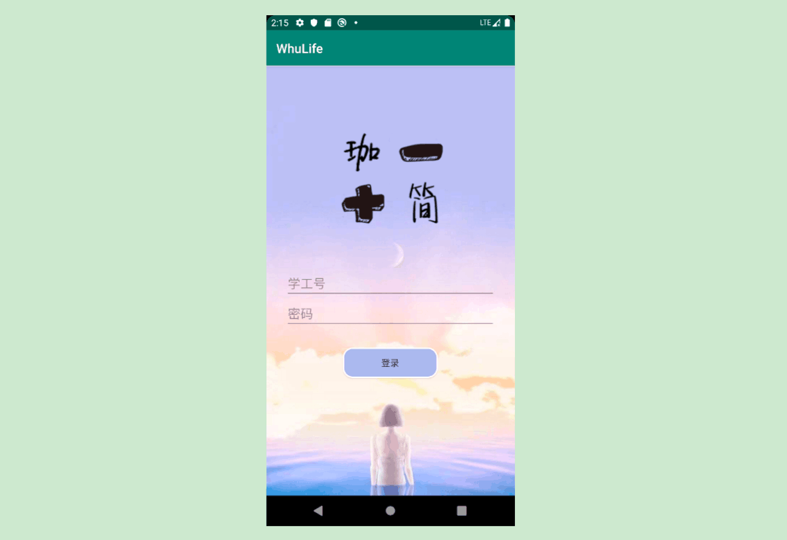
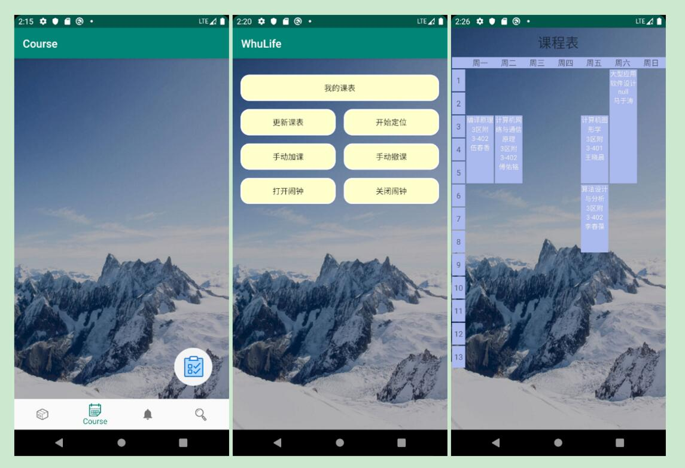
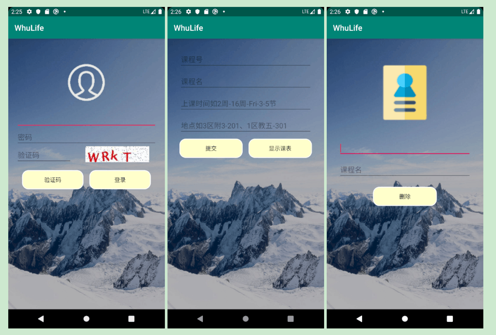
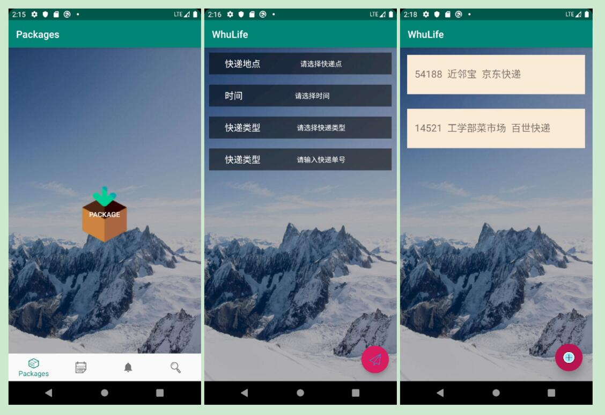
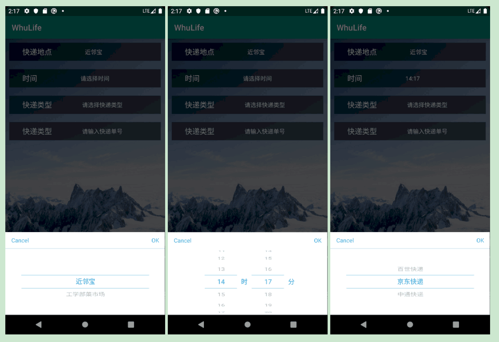
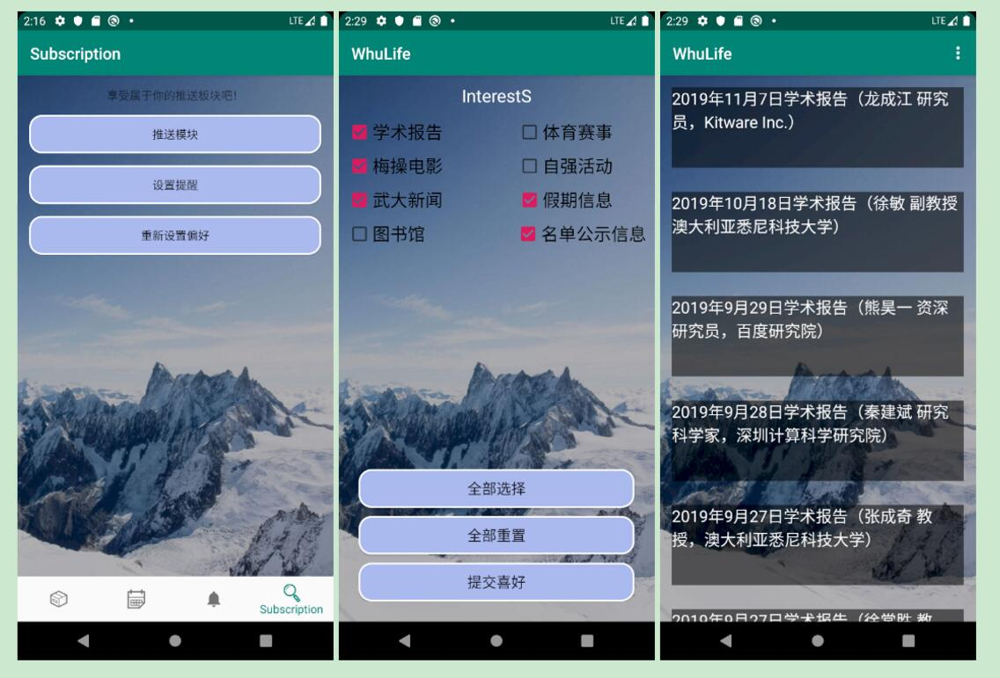
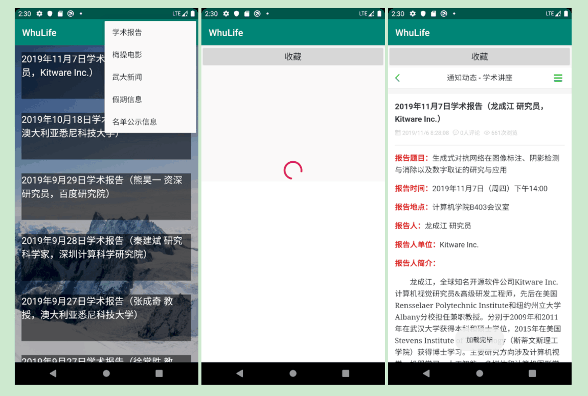
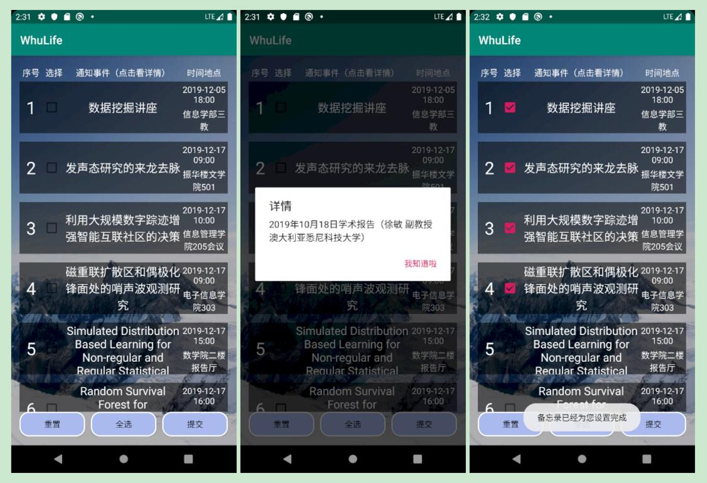
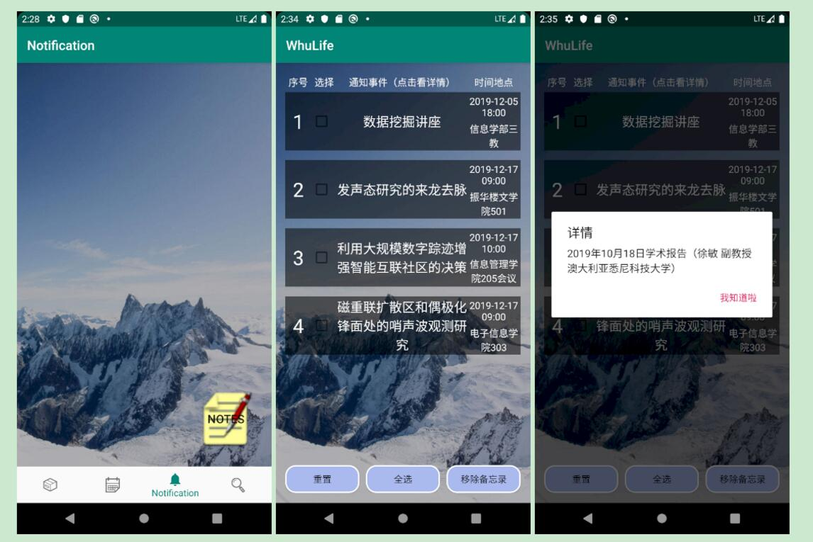

# WHULife
This is a project for WHUer to enjoy an easier campus life.

## 1. 开发规划

### 1.1 开发人员

|模块分组|开发人员|
|-------|--------|
|课程及考试信息获取|伍晶晶 姜星宇|
|地点定位及快递提醒|徐嘉坤 马润|
|推送及兴趣备忘模块|康楷晨 胡凯迪|
|UI设计小组和客户|李王晨 李凌威（客户）|

### 1.2 开发环境和工具

- Windows系统
- Android Studio集成开发环境
- GitHub团队项目管理
- Java语言

---------------------

## 2. 项目总体描述

### 2.1 基本设计描述

1. 直接导入的可提醒项目有：

- 上课地点的课程信息
需要教务系统权限以及时间信息，上课提前按时间信息通知，位置接近后可以提醒上课教室，后期可以考虑按专业基于当前位置推荐其他课程的应用-蹭课小助手。

2. 自主添加的信息提醒：

- 快递地点的提醒服务
时间和地点信息提醒需要进行双重考虑，确保人性化提醒，防止由于宿舍和快递点过近造成的不断提醒，也防止离快递点过远造成的不能提醒；并且最后希望加入提醒级别，比如第一次振动或全屏窗提醒，用户可以设置稍后提醒，随后只是挂在通知栏内防止一致打扰用户。
- 考试信息
考虑需要提前提醒 基于时间 地点有点不考虑实际情况。
- 自主订阅服务
相关讲座、梅操电影、体育比赛等。
- 自主订阅方向文章推荐

### 2.2 主要界面功能流程描述

登录界面

1. 用户可以进行APP的登录
2. 进入登录界面之前增加了过渡动画（详情参考演示视频）

-------------------

课程内容获取数据库相关情况

1. 用户可以根据自己的教务系统账号和密码进行课程内容的同步，数据将备份到本机中以备使用
2. 增加了用户获取的课程表的展示功能
3. 修复了登录教务系统时部分验证码bug
4. 增加了基于地点进行上课提醒的功能（用户在地点附近会智能提醒后面将要到来的课程）
5. 增删的课程可以在课表栏中显示

--------------

定位信息获取及提醒事件添加

1. 用户可以在此服务界面中允许定位功能之后，我们可以及时根据用户的地点信息进行提醒服务
2. 用户可以根据我们预先设计的快递备忘事项进行选择，以个性化的生成备忘事件，自动用于后期提醒
3. 我们可以展示所有用户还没有处理的已填加快递事项

--------------
订阅推送模块

兴趣设置及新闻推送部分

1. 在该部分中用户第一次进入时会让其设置自己的喜好
2. 我们根据用户设置的喜好可以在右上方按照用户的喜好分类推送文章
3. 用户点击新闻后可以进行浏览与收藏
4. 用户可以重新设置兴趣，以便让我们推送新的方向

备忘录部分

1. 用户可以在我们为用户按兴趣设置的候选备忘事件中设置相关备忘事项
2. 用户点击通知事件时我们会显示更详细的事件内容
3. 当用户非第一次登进该界面时，可以进行新的事件添加，我们会将新事件进行存储

------------------

用户已填加备忘录展示部分

1. 在该界面中用户可以对添加的事件进行查看操作
2. 用户可以在该界面中删除已经添加的活动，那么不再提醒
