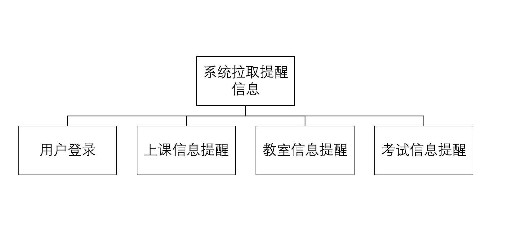
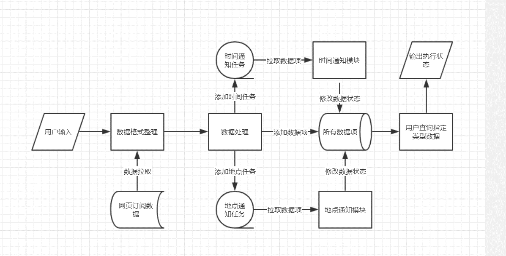

# 需求分析

## 1. 引言

### 1.1  开发意图

&emsp;&emsp;大学生学习生活事务繁多，许多事情经常遗忘，比如上课时间、上课地点以及快递的接收等，大学信息获取凭自己，很多相关信息经常不能及时了解，造成了许多问题，我们希望开发一款基于 Android 的 app，能够在恰当的时间或者合适的地点及时提醒你可能遗忘的事情，并且在你的选择下推送更多生活资讯，丰富你的大学生活。

### 1.2  项目背景

#### 项目名称

 珈简生活

#### 小组成员

- 康楷晨
- 胡凯迪
- 李凌威
- 伍晶晶
- 姜星宇
- 徐嘉坤
- 马润
- 李王晨

### 1.3  产品描述

&emsp;&emsp;正如项目名所示，我们希望能简化武汉大学在校本科生的学习生活，防止遗忘，同时也能增加更多有趣的信息丰富大家的课余生活。

### 1.4  参考文献

----------

## 2. 项目概述

### 2.1  待开发软件的一般描述

### 2.2  待开发软件的功能

#### 功能规定
&emsp;&emsp;基于当前位置或时间（位置信息可由高德API获取）的信息进行提醒服务。本质上获取位置信息之后就相当于拿到了系统的输入，输出都是根据位置信息选择，我们将会把时间和位置信息捆绑存储，方便比对与使用。

#### 具体功能
1. 直接导入的可提醒项目有：
- 上课地点的课程信息
&emsp;&emsp;需要教务系统权限以及时间信息，上课提前按时间信息通知，位置接近后可以提醒上课教室，后期可以考虑按专业基于当前位置推荐其他课程的应用-蹭课小助手。

2. 自主添加的信息提醒：
- 快递地点的提醒服务
&emsp;&emsp;时间和地点信息提醒需要进行双重考虑，确保人性化提醒，防止由于宿舍和快递点过近造成的不断提醒，也防止离快递点过远造成的不能提醒；并且最后希望加入提醒级别，比如第一次振动或全屏窗提醒，用户可以设置稍后提醒，随后只是挂在通知栏内防止一致打扰用户。
- 考试信息
&emsp;&emsp;考虑需要提前提醒 基于时间 地点有点不考虑实际情况。
- 自主订阅服务
&emsp;&emsp;相关讲座、梅操电影、体育比赛等。

- 重点需要考虑的问题：
&emsp;&emsp;提醒的次数和时间问题：如基于位置的提醒范围问题提醒后万一不想做，可以设置延时提醒（快递方面）等。

### 2.3  用户特征和水平

&emsp;&emsp;针对whu在校本科生（可扩展到研究生），用户特点是在校大学生，掌握了基本 app 使用，但是由于需要记忆的事务太多经常遗忘东西的人群。

### 2.4  运行环境

+ 搭载Android7.0-9.0操作系统的安卓手机
+ 内存1GB以上
+ 空闲存储大于500MB
+ 有定位功能
+ 要求连接网络（按地点信息） 也可脱机（按时间提醒时）

---------
## 3.功能详细描述
### 3.1 功能划分
+ 顶层系统结构图
 
+ 系统拉取提醒信息模块
 
+ 快递信息提醒模块
 
+ 自主订阅模块
 

### 3.2 功能详细描述
+ 系统拉取提醒信息模块数据流图
 
+ 快递信息提醒模块数据流图
 
+ 自主订阅模块数据流图
 
---------

## 4. 外部接口需求

### 4.1  用户界面

### 4.2  硬件接口

### 4.3  软件接口
- Web浏览器
- 高德地图 地图及定位信息
- 微信公众号服务

### 4.4  故障处理

-------

## 5. 性能需求

### 5.1 数据精确度

输入、输出精度-----输入主要是位置信息和时间信息 这里主要说明位置信息，正常定位精度不要求太高（50m范围即可提醒）。

### 5.2 用户数量及并发性

本地机完成处理工作，对并发没有太高要求

### 5.3 响应时间及数据传输时间

不大于3秒钟

### 5.4 适应性

运行环境改变、其他软件接口变化、操作方式变化

------

## 6. 其他未来可能需求
---------
## 7. 数据描述

### 7.1 静态数据（本身存储的）
1. 用户教务系统登录信息

字段名|数据类型|长度|主键|非空|描述
-|-|-|-|-|-
Sno|Varchar|20|是|是|用户学号
Password|Varchar|10|否|是|密码

2. 教务系统信息

字段名|数据类型|长度|主键|非空|描述
-|-|-|-|-|-
Sno|Varchar|20|是|是|用户学号
Cno|Varchar|20|是|是|课程编号
Cname|Varchar|30|否|是|课程名称
Ctime|Datetime|/|否|是|课程时间
Clocation|Point|/|否|是|课程教学地点经纬度
Croom|Varchar|20|否|是|课程教室

3. 快递提醒相关信息

字段名|数据类型|长度|主键|非空|描述
-|-|-|-|-|-
number|Varchar|15|是|是|快递取件码便于你轻松取件
Clocation|Point|/|否|是|地点数据
Ctime|Datetime|/|否|是|时间信息
type|Varchar|20|否|是|所要取的快递类型
message|Varchar|50|否|是|相关备忘信息

### 7.2 动态数据（输入输出数据）

计划数据
计划数据是系统处理的核心数据, 其定义如下:
数据项名称: 计划数据
别名: 无
简述: 系统处理的核心数据
组成: 计划id+时间+地点+通知信息+备注信息+状态
组织方式: 数组

计划id=""
时间="YYYYMMDDHHMM"
地点="Longitude latitude"
通知信息={utf8字符串}1-30
备注信息={utf8字符串}1-1000
状态=[未添加|待提醒|已处理]
提醒次数设置=[0-9]

输入输出数据类型 格式 结构说明
这部分重点处理好 避免后续编写不断修改

### 7.3 数据库描述

### 7.4 数据字典

## 8. 附录

