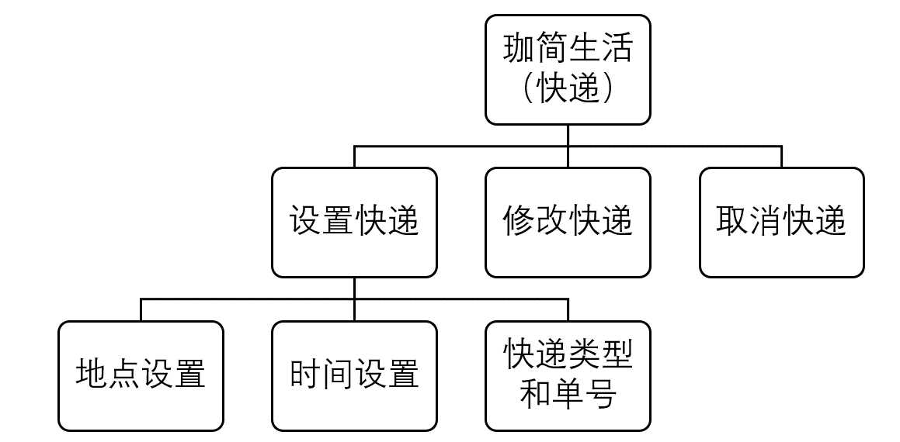
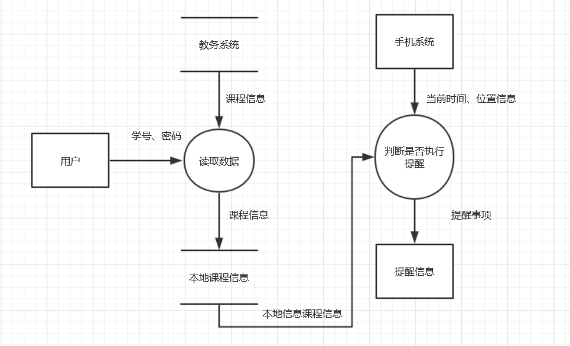
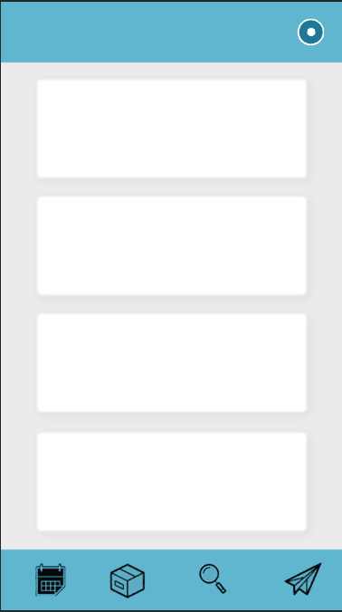

# 需求分析

## 1. 引言

### 1.1  开发意图

大学生学习生活事务繁多，许多事情经常遗忘，比如上课时间、上课地点以及快递的接收等。大学信息获取凭自己，很多相关信息经常不能及时了解，造成了许多问题。因此，我们希望开发一款基于 Android 的 app，能够在恰当的时间或者合适的地点及时提醒你可能遗忘的事情，并且在你的选择下自主订阅更多生活资讯、公开讲座、社交活动，丰富你的大学生活。

### 1.2  项目背景

#### 项目名称

 珈简生活

#### 小组成员

- 康楷晨
- 胡凯迪
- 李凌威
- 伍晶晶
- 姜星宇
- 徐嘉坤
- 马润
- 李王晨

### 1.3  产品描述

正如项目名所示，我们希望它能简化武汉大学在校本科生的学习生活，防止遗忘，同时也能增加更多有趣的信息丰富大家的课余生活。提醒用户顺路领取快递，提醒用户按时参加课程学习，提醒用户做各种打算做的事。

### 1.4  参考文献

软件工程 清华大学出版社

----------

## 2. 项目概述

### 2.1  待开发软件的一般描述

用户的私人管家，帮助用户记忆繁杂的事项，及时提醒，减轻用户的记忆负担，让用户把精力放在自己想做的事情上。

### 2.2  待开发软件的功能

- 基于时间的定时提醒功能
- 基于位置的定位提醒功能
- 基于 web 的活动信息订阅

#### 功能规定

基于当前位置或时间（位置信息可由高德 API 获取）的信息进行提醒服务。本质上获取位置信息之后就相当于拿到了系统的输入，输出都是根据位置信息选择，我们将会把时间和位置信息捆绑存储，方便比对与使用。

时间上有一个时间任务队列，系统负责维护该队列。该队列为时间优先队列，定时查询队列。如果发现当前时间有需要响应的任务，应用向手机系统发送提醒，告知用户当前有任务需要处理。用户可以选择确认，此时系统便会从队列中清除该项目。如果用户选择稍后提醒，则推迟时间，重新推送至任务队列，等待下一次提醒。如用户未在指定时间内响应，则系统默认为用户选择了稍后提醒，处理方式同上。

地点亦有一个地点队列，系统维护该队列。系统定时查询用户位置信息，如果用户位置信息与任务的地点一致或者在规定的距离里面，则向手机系统发送一次提醒。用户依旧可以选择确认，此时系统便会从队列中清除该项目。如果用户选择稍后提醒或无响应，则系统添加该任务为时间任务，之后的处理同上述时间事件。

#### 具体功能

1. 直接导入的可提醒项目有：

- 上课地点的课程信息
需要教务系统权限以及时间信息，上课提前按时间信息通知，位置接近后可以提醒上课教室，后期可以考虑按专业基于当前位置推荐其他课程的应用-蹭课小助手。

2. 自主添加的信息提醒：

- 快递地点的提醒服务
时间和地点信息提醒需要进行双重考虑，确保人性化提醒，防止由于宿舍和快递点过近造成的不断提醒，也防止离快递点过远造成的不能提醒；并且最后希望加入提醒级别，比如第一次振动或全屏窗提醒，用户可以设置稍后提醒，随后只是挂在通知栏内防止一致打扰用户。
- 考试信息
考虑需要提前提醒 基于时间 地点有点不考虑实际情况。
- 自主订阅服务
相关讲座、梅操电影、体育比赛等。

#### 重点需要考虑的问题

提醒的次数和时间问题：如基于位置的提醒范围问题提醒后万一不想做，可以设置延时提醒（快递方面）等。

### 2.3  用户特征和水平

针对 whu 在校本科生（可扩展到研究生），用户特点是在校大学生，掌握了基本 app 使用，但是由于需要记忆的事务太多经常遗忘东西的人群。

### 2.4  运行环境

+ 搭载 Android7.0-9.0 操作系统的安卓手机
+ 内存 1GB 以上
+ 空闲存储大于 500MB
+ 有定位功能
+ 要求连接网络（按地点信息） 也可脱机（按时间提醒时）

---------

## 3. 功能详细描述

### 3.1 功能划分

####  3.1.1 顶层系统结构图

#### 

####  3.1.2 系统拉取提醒信息模块

#### 

#### 3.1.3 快递信息提醒模块

 

#### 3.1.4 自主订阅模块

 

### 3.2 功能详细描述

#### 3.2.1 系统拉取提醒信息模块数据流图

 

#### 3.2.2 快递信息提醒模块数据流图

 

#### 3.2.3 自主订阅模块数据流图

 

---------

## 4. 外部接口需求

### 4.1  用户界面

 

### 4.2  硬件接口

暂无

### 4.3  软件接口

- Web浏览器
- 高德地图 地图及定位信息
- 微信公众号服务

### 4.4  故障处理

异常处理，日志记录异常情况，在用户同意的情况下，匿名发送日志信息供开发者分析。

-------

## 5. 性能需求

### 5.1 数据精确度

输入、输出精度

输入主要是位置信息和时间信息。这里主要说明位置信息，正常定位精度不要求太高（ 50m 范围即可提醒）。

### 5.2 用户数量及并发性

本地机完成处理工作，对并发没有太高要求

### 5.3 响应时间及数据传输时间

用户操作反馈时间不大于 3 秒钟

web 数据接收时间不超过 10 秒钟

### 5.4 适应性

运行环境改变、其他软件接口变化、操作方式变化

------

## 6. 其他未来可能需求

提供后台 web 接口，供活动组织添加活动信息。

---------

## 7. 数据描述

### 7.1 静态数据（本身存储的）

1. 用户教务系统登录信息

| 字段名   | 数据类型 | 长度 | 主键 | 非空 | 描述     |
| -------- | -------- | ---- | ---- | ---- | -------- |
| Sno      | VARCHAR  | 20   | 是   | 是   | 用户学号 |
| Password | VARCHAR  | 20   | 否   | 是   | 密码     |

2. 教务系统信息

| 字段名     | 数据类型 | 长度 | 主键 | 非空 | 描述         |
| ---------- | -------- | ---- | ---- | ---- | ------------ |
| Sno        | VARCHAR  | 20   | 是   | 是   | 用户学号     |
| Cno        | VARCHAR  | 20   | 是   | 是   | 课程编号     |
| Cname      | VARCHAR  | 30   | 否   | 是   | 课程名称     |
| Ctime      | DATETIME | 8    | 否   | 是   | 课程时间     |
| CLongitude | FLOAT    | 4    | 否   | 是   | 教学地点经度 |
| CLatitude  | FLOAT    | 4    | 否   | 是   | 教学地点纬度 |
| Croom      | VARCHAR  | 20   | 否   | 是   | 课程教室     |

3. 快递提醒相关信息

| 字段名     | 数据类型 | 长度 | 主键 | 非空 | 描述                     |
| ---------- | -------- | ---- | ---- | ---- | ------------------------ |
| Eno        | VARCHAR  | 15   | 是   | 是   | 快递取件码便于你轻松取件 |
| ELongitude | FLOAT    | 4    | 否   | 是   | 快递点经度               |
| ELatitude  | FLOAT    | 4    | 否   | 是   | 快递点纬度               |
| Etime      | DATETIME | 8    | 否   | 是   | 时间信息                 |
| Etype      | VARCHAR  | 20   | 否   | 是   | 快递类型                 |
| Emessage   | VARCHAR  | 50   | 否   | 是   | 相关备忘信息             |

4. 待办事项

| 字段名     | 数据类型  | 长度 | 主键 | 非空 | 描述                                 |
| ---------- | --------- | ---- | ---- | ---- | ------------------------------------ |
| Pid        | INTEGER   | 4    | 是   | 是   | 提醒计划的唯一标识号                 |
| Ptime      | TIMESTAMP | 4    | 否   | 否   | 待办事项的时间                       |
| PLongitude | FLOAT     | 4    | 否   | 否   | 待办事项的地点经度                   |
| PLatitude  | FLOAT     | 4    | 否   | 否   | 待办事项的地点纬度                   |
| PPush      | VARCHAR   | 60   | 否   | 是   | 提醒时的弹窗信息                     |
| PInfo      | VARCHAR   | 200  | 否   | 是   | 详细的事项描述                       |
| PStatus    | VARCHAR   | 10   | 否   | 是   | 事项的状态, [未添加\|待提醒\|已处理] |
| PTimes     | SMALLINT  | 2    | 否   | 是   | 已经提醒的次数                       |

### 7.2 动态数据（输入输出数据）

输入：
- 用户喜好设置
- 用户自定义提醒数据
- 教务系统处理数据
- 自主订阅数据

输出：
- 提醒信息
- 推送信息

### 7.3 数据字典

待办事项
别名：任务  to-do
简述：所有的待办事项, 包括用户添加的已提醒、未提醒 以及未添加的事项
组成：计划id+时间+经度+纬度+通知信息+备注信息+状态+已处理次数
组织方式：数组

时间计划队列
别名：时间队列 时间提醒事项
简述：状态为未提醒的，时间数据项非空的待办事项的集合。
组成：待提醒时间+计划id
组织方式：队列

地点计划队列
别名：地点队列 地点提醒事项
简述：状态为未提醒的，经纬度数据项非空的待办事项的集合。
组成：待提醒经纬度+计划id
组织方式：队列

## 8. 附录

暂无
