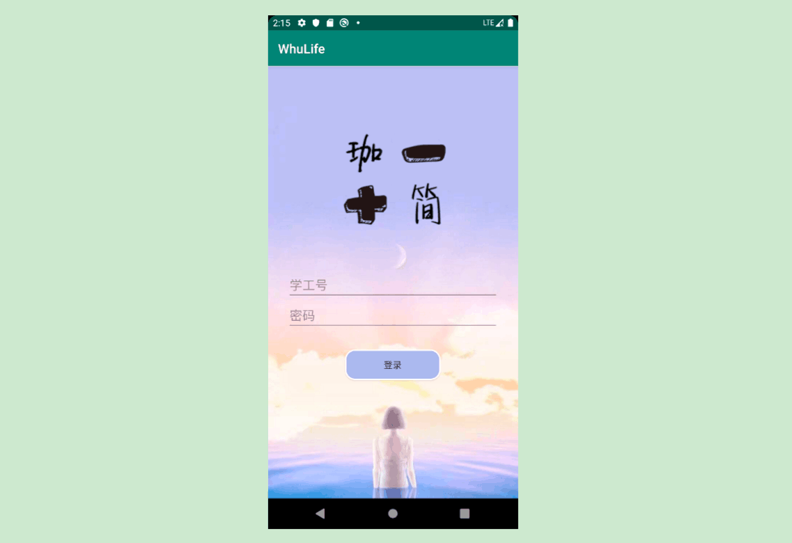
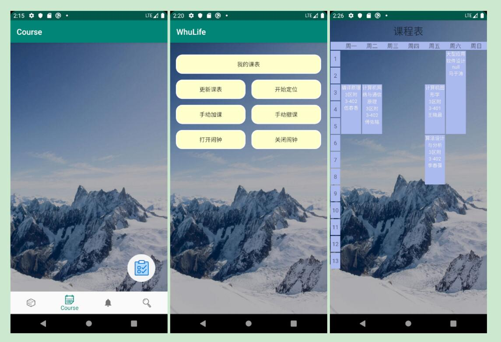
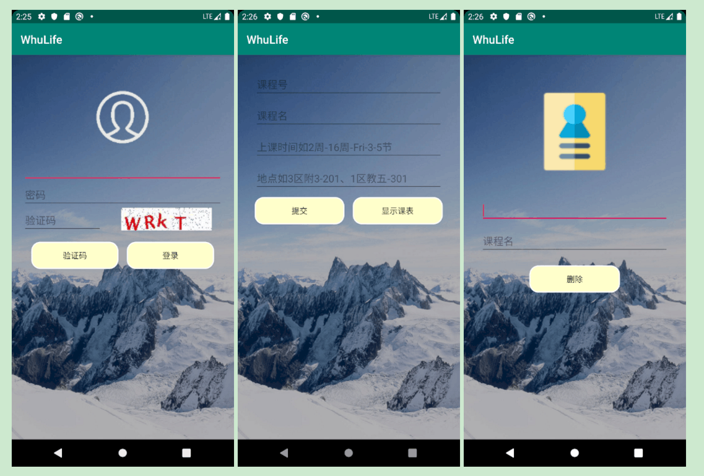
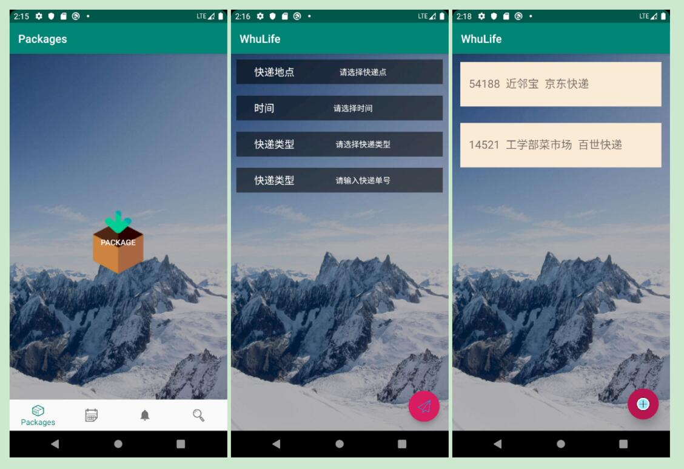
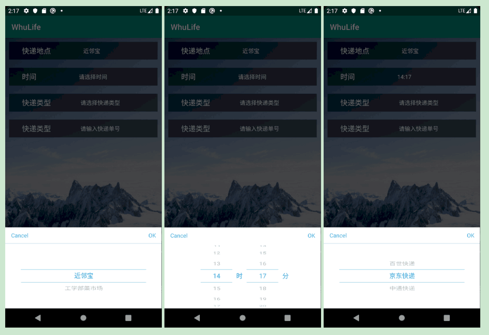
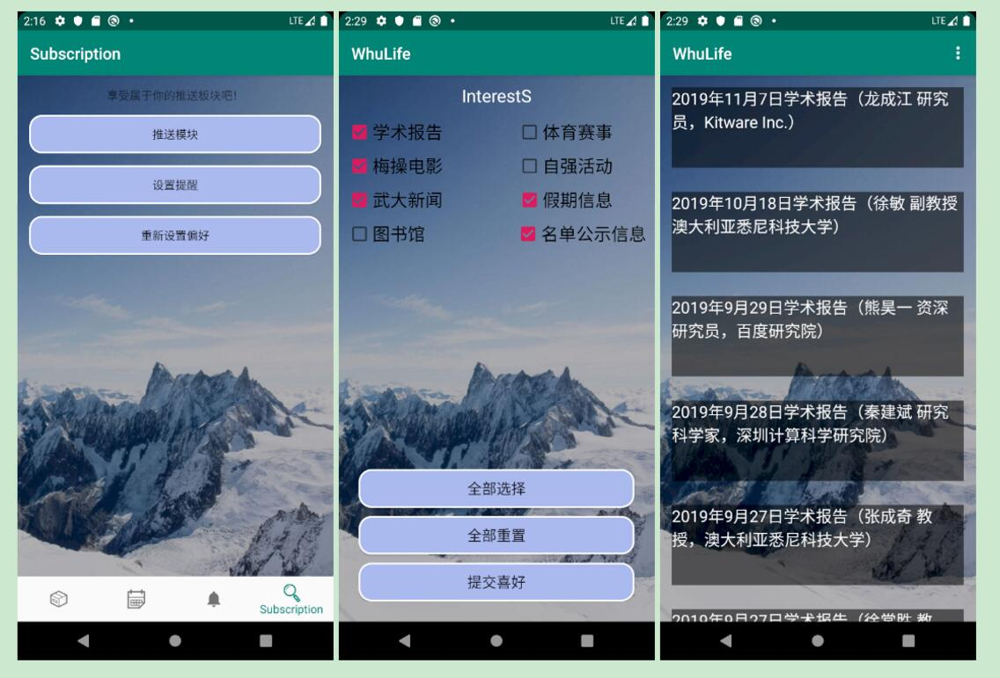
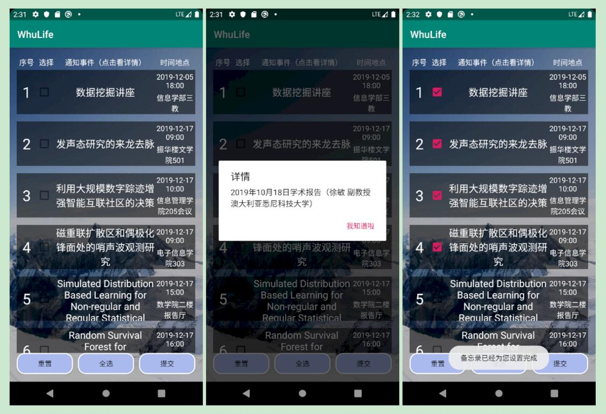
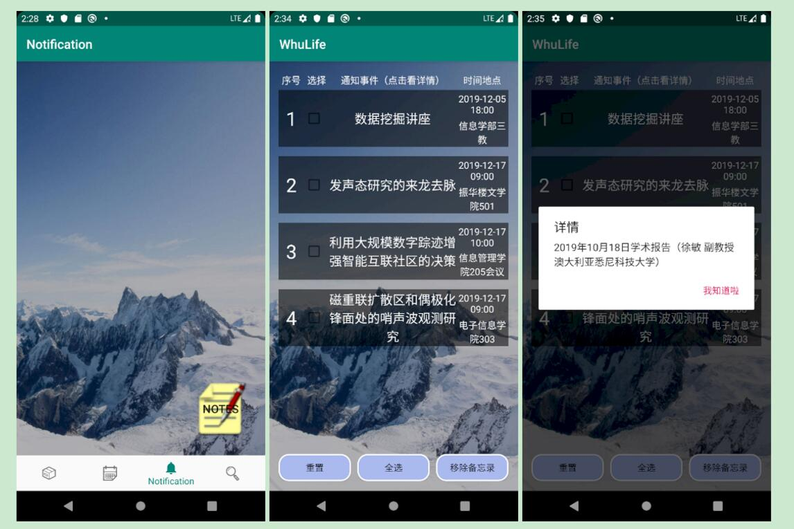

# 第三次迭代文档

## 1. 开发规划

### 1.1 开发人员

|模块分组|开发人员|
|-------|--------|
|课程及考试信息获取|伍晶晶 姜星宇|
|地点定位及快递提醒|徐嘉坤 马润|
|推送及兴趣备忘模块|康楷晨 胡凯迪|
|UI设计小组和客户|李王晨 李凌威（客户）|

### 1.2 开发环境和工具

- Windows系统
- Android Studio集成开发环境
- GitHub团队项目管理
- Java语言

### 1.3 项目开发进度概述

- 主体UI风格统一完成
- 课程内容获取通过测试、出现bug修复完毕
- 地点定位模块通过测试、出现bug修复完毕
- 快递提醒信息通过测试、出现bug修复完毕
- 推送信息模块通过测试、出现bug修复完毕
- 兴趣备忘录选择模通过测试、出现bug修复完毕
- 增加了用户课程表的显示功能
- 增加了用户设置提醒服务的展示与增改功能
- 处理了界面过渡时的等待动画
- 优化了数据库的读取、解决了部分数据之前读取存在的bug

---------------------

## 2. 项目总体描述

### 2.1 基本设计描述

1. 直接导入的可提醒项目有：

- 上课地点的课程信息
需要教务系统权限以及时间信息，上课提前按时间信息通知，位置接近后可以提醒上课教室，后期可以考虑按专业基于当前位置推荐其他课程的应用-蹭课小助手。

2. 自主添加的信息提醒：

- 快递地点的提醒服务
时间和地点信息提醒需要进行双重考虑，确保人性化提醒，防止由于宿舍和快递点过近造成的不断提醒，也防止离快递点过远造成的不能提醒；并且最后希望加入提醒级别，比如第一次振动或全屏窗提醒，用户可以设置稍后提醒，随后只是挂在通知栏内防止一致打扰用户。
- 考试信息
考虑需要提前提醒 基于时间 地点有点不考虑实际情况。
- 自主订阅服务
相关讲座、梅操电影、体育比赛等。
- 自主订阅方向文章推荐


### 2.2 主要界面功能流程描述

登录界面



1. 用户可以进行APP的登录
2. 进入登录界面之前增加了过渡动画（详情参考演示视频）

-------------------


课程内容获取数据库相关情况






1. 用户可以根据自己的教务系统账号和密码进行课程内容的同步，数据将备份到本机中以备使用
2. 增加了用户获取的课程表的展示功能
3. 修复了登录教务系统时部分验证码bug
4. 增加了基于地点进行上课提醒的功能（用户在地点附近会智能提醒后面将要到来的课程）
5. 增删的课程可以在课表栏中显示

--------------

定位信息获取及提醒事件添加





1. 用户可以在此服务界面中允许定位功能之后，我们可以及时根据用户的地点信息进行提醒服务
2. 用户可以根据我们预先设计的快递备忘事项进行选择，以个性化的生成备忘事件，自动用于后期提醒
3. 我们可以展示所有用户还没有处理的已填加快递事项

--------------
订阅推送模块

兴趣设置及新闻推送部分




1. 在该部分中用户第一次进入时会让其设置自己的喜好
2. 我们根据用户设置的喜好可以在右上方按照用户的喜好分类推送文章
3. 用户点击新闻后可以进行浏览与收藏
4. 用户可以重新设置兴趣，以便让我们推送新的方向

备忘录部分



1. 用户可以在我们为用户按兴趣设置的候选备忘事件中设置相关备忘事项
2. 用户点击通知事件时我们会显示更详细的事件内容
3. 当用户非第一次登进该界面时，可以进行新的事件添加，我们会将新事件进行存储

------------------

用户已填加备忘录展示部分



1. 在该界面中用户可以对添加的事件进行查看操作
2. 用户可以在该界面中删除已经添加的活动，那么不再提醒

-------------

## 3. 数据描述部分修改

1. 用户教务系统登录信息

| 字段名   | 数据类型 | 长度 | 主键 | 非空 | 描述     |
| -------- | -------- | ---- | ---- | ---- | -------- |
| Sno      | VARCHAR  | 20   | 是   | 是   | 用户学号 |
| Password | VARCHAR  | 20   | 否   | 是   | 密码     |

2. 教务系统信息

| 字段名     | 数据类型 | 长度 | 主键 | 非空 | 描述         |
| ---------- | -------- | ---- | ---- | ---- | ------------ |
| Sno        | VARCHAR  | 20   | 是   | 是   | 用户学号     |
| Cno        | VARCHAR  | 20   | 是   | 是   | 课程编号     |
| Cname      | VARCHAR  | 30   | 否   | 是   | 课程名称     |
| Ctime      | DATETIME | 8    | 否   | 是   | 课程时间     |
| CLongitude | FLOAT    | 4    | 否   | 是   | 教学地点经度 |
| CLatitude  | FLOAT    | 4    | 否   | 是   | 教学地点纬度 |
| Croom      | VARCHAR  | 20   | 否   | 是   | 课程教室     |

3. 快递提醒相关信息

| 字段名     | 数据类型 | 长度 | 主键 | 非空 | 描述                     |
| ---------- | -------- | ---- | ---- | ---- | ------------------------ |
| Eno        | VARCHAR  | 15   | 是   | 是   | 快递取件码便于你轻松取件 |
| ELongitude | FLOAT    | 4    | 否   | 是   | 快递点经度               |
| ELatitude  | FLOAT    | 4    | 否   | 是   | 快递点纬度               |
| Etime      | DATETIME | 8    | 否   | 是   | 时间信息                 |
| Etype      | VARCHAR  | 20   | 否   | 是   | 快递类型                 |
| Emessage   | VARCHAR  | 50   | 否   | 是   | 相关备忘信息             |

4. 待办事项

| 字段名     | 数据类型  | 长度 | 主键 | 非空 | 描述                                 |
| ---------- | --------- | ---- | ---- | ---- | ------------------------------------ |
| Pid        | INTEGER   | 4    | 是   | 是   | 提醒计划的唯一标识号                 |
| Ptime      | TIMESTAMP | 4    | 否   | 否   | 待办事项的时间                       |
| PLongitude | FLOAT     | 4    | 否   | 否   | 待办事项的地点经度                   |
| PLatitude  | FLOAT     | 4    | 否   | 否   | 待办事项的地点纬度                   |
| PPush      | VARCHAR   | 60   | 否   | 是   | 提醒时的弹窗信息                     |
| PInfo      | VARCHAR   | 200  | 否   | 是   | 详细的事项描述                       |
| PStatus    | VARCHAR   | 10   | 否   | 是   | 事项的状态【未添加、待提醒、已处理】|
| PTimes | SMALLINT | 2 | 否 | 是 | 已经提醒的次数 |
## 4. 接口规范

### 4.1 主要接口内容说明

- 基于时间的提醒服务
- 基于地点的提醒服务

本APP主要功能的实现是将用户所添加的待提醒时间添加到一个提醒队列中，根据时间和地点信息将待提醒内容送入相应的提醒服务中，让手机进行提醒服务。

-------------------

基于时间的提醒服务主要参数是当前时间信息、备忘录时间信息、备忘录主要事件内容等。

1.初始化函数，定义AlarmManager类，提供对系统闹钟服务的访问接口；定义事件Intent和PendingIntent，这个类用于处理即将发生的事情，从系统取得一个用于向BroadcastReceiver的Intent广播的PendingIntent对象,由参数id 来区分不同的闹钟。
`public void createAlarmManager(int id)`

2.设置闹钟函数，参数为年、月、日、时、分、秒，利用calendar.set()函数确定闹钟开始时间，根据API版本不同使用不同的方法设置闹钟。setExactAndAllowWhileIdle()和setExact()是一次性闹钟，setRepeating()是周期性闹钟，intervalTime为周期参数。
`public void setAlarm(int year1,int month1,int date1,int hour1,int minute1,int second1)`

3.取消闹钟函数，需要重新intent和和PendingIntent，cancel(PendingIntent)取消闹。参数id确定要取消的闹钟。
`public void cancelAlarm(int id)`

4.AlarmReceiver.java广播接收。继承BroadcastReceiver类，闹钟时间到时调用，并用startActivity()函数启动RingActivity活动

5.RingActivity.java定义MediaPlayer实例，设置要播放的音乐，start()开始播放，stop()通知播放

6.NotificationCompat.Builder实例化通知栏构造器，设置参数；NotificationManager创建通知栏管理器，notify()发送通知

-------------

基于地点的提醒服务主要的参数是当前的地点信息、备忘录的经度、纬度信息以及备忘录主要事件内容等。

1.定义一个OurLocation类，并实例化，需要传入当前活动上下文  
`public OurLocation myLocation = new OurLocation(MainActivity.this);`   
2.定义一个地图管理类AMapLocationClient，并实例化  
```Java
public AMapLocationClient mapLocationClient = null;
mapLocationClient = new AMapLocationClient(this.getApplicationContext());
```
3.初始化定位   
`myLocation.initLocation(mapLocationClient);`  
5.开始定位  
`myLocation.startLocation();`  
6.结束定位  
`myLocation.destroyLocation();`  
7.暂停定位  
`myLocation.stopLocation();`  

## 5.后端编写

本APP的订阅推送部分要向用户进行数据的定向推送，使用js脚本语言编写了数据的爬取与分类，并且可以与用户本地操作进行实时交互，返回用户请求的相关数据，也可以按照不同的请求返回分类好的数据（详情可见用户设置喜好后推荐文章的分类）。

```js
const http = require('http');
const url = require('url');
const fs = require('fs');
const querystring = require('querystring');
let urls = JSON.parse(fs.readFileSync('_url.json', 'utf8'));
module.exports = () => {// api/news/?all
    http.createServer((req, res) => {
        let data = "";
        req.on('data', (e) => { data += e });
        req.on('end', () => {
            console.log(data);
            let path = url.parse(req.url).pathname;
            let query = querystring.parse(url.parse(req.url).query);
            let resText;
            try {
                if (path.startsWith('/api/news/')) {//
                    let resArr = [];
                    if (query['all'] !== undefined || query['lecture'] !== undefined) urls['academic'].forEach((e) => { resArr.push(e) });//返回所有
                    if (query['all'] !== undefined || query['whunews'] !== undefined) urls['news'].forEach((e) => { resArr.push(e) });
                    if (query['all'] !== undefined || query['holiday'] !== undefined) urls['notification'].forEach((e) => { resArr.push(e) });
                    if (query['all'] !== undefined || query['bulletin'] !== undefined) urls['bulletin'].forEach((e) => { resArr.push(e) });
                    if (query['all'] !== undefined || query['sports'] !== undefined) urls['sports'].forEach((e) => { resArr.push(e) });//返回所有
                    if (query['all'] !== undefined || query['movie'] !== undefined) urls['movie'].forEach((e) => { resArr.push(e) });
                    if (query['all'] !== undefined || query['supermarket'] !== undefined) urls['supermarket'].forEach((e) => { resArr.push(e) });
                    if (query['all'] !== undefined || query['library'] !== undefined) urls['library'].forEach((e) => { resArr.push(e) });
                    resText = JSON.stringify(resArr);
                } else if (path.startsWith('/api/msg/')) {//
                    let resArr = JSON.parse(fs.readFileSync('_message.json', 'utf8'));
                    try {
                        let qu =  JSON.parse(JSON.parse(data).Num);
                        resArr  = resArr.filter((e)=>{return qu.includes(e.mid)});
                    } catch (error) {
                        
                    }
                    resText=JSON.stringify(resArr);
                } else {//兼容旧 api
                    resText = url.parse(req.url).pathname === '/' ? fs.readFileSync('url.json', 'utf8') : fs.readFileSync('_message.json', 'utf8');
                }
                res.writeHead(200, { "Content-Type": "application/json" });
                res.write(resText);
                res.end();
            } catch (error) {
                console.log(error);
                res.writeHead(500, {});
                res.write("error");
                res.end();
            }
        });

    }).listen(8888);
}
module.exports();
```
