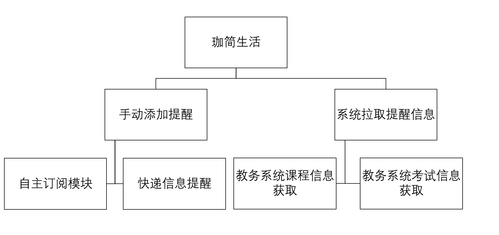
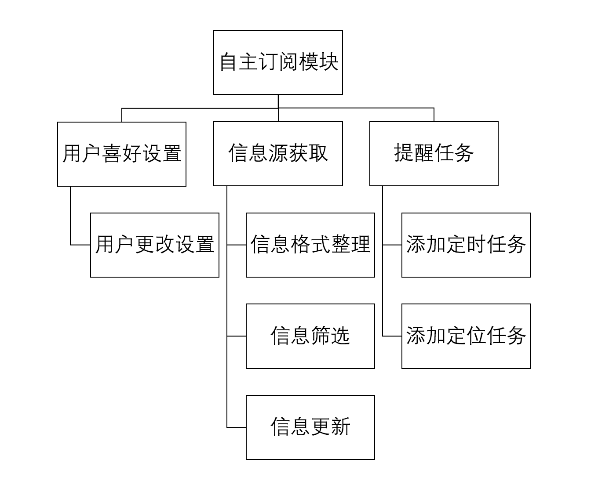
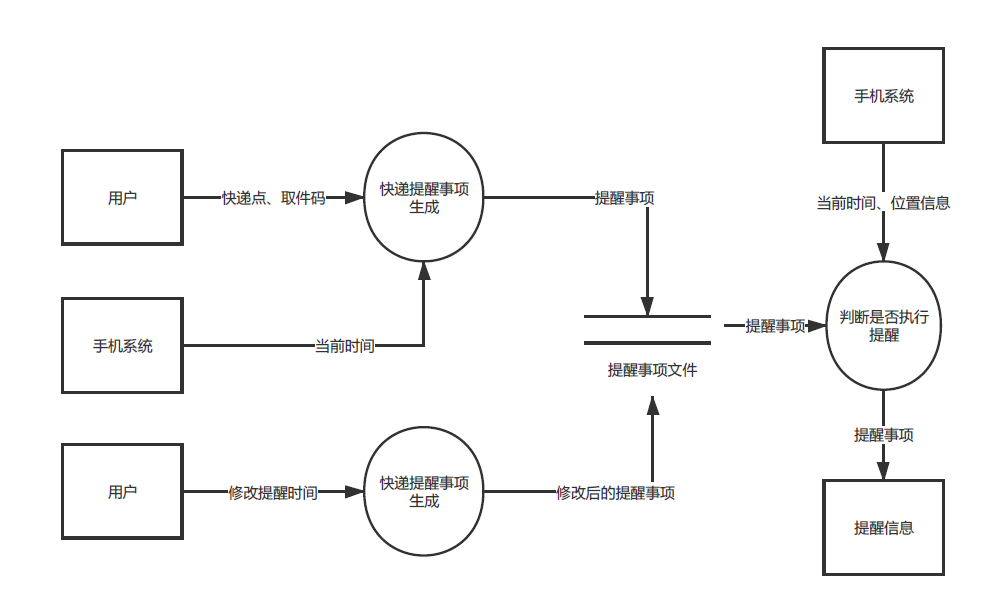
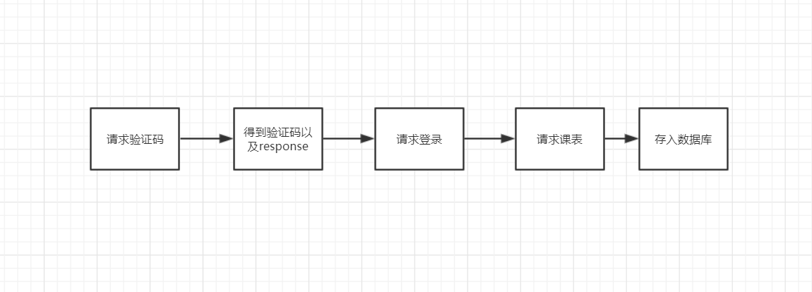
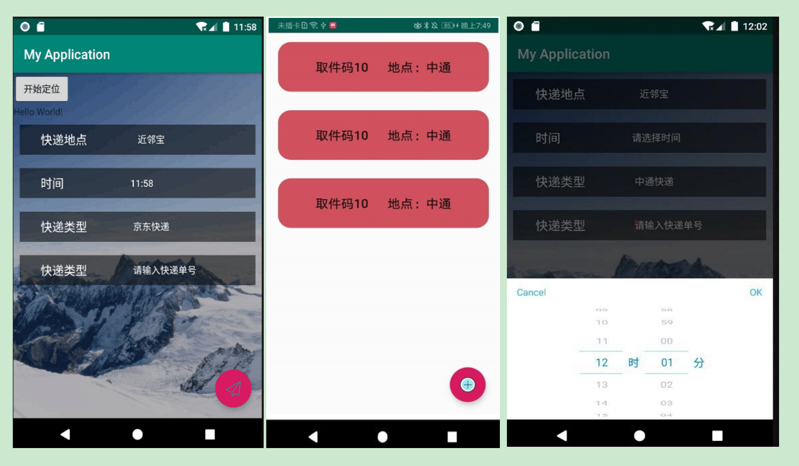
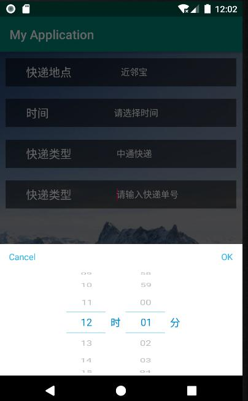
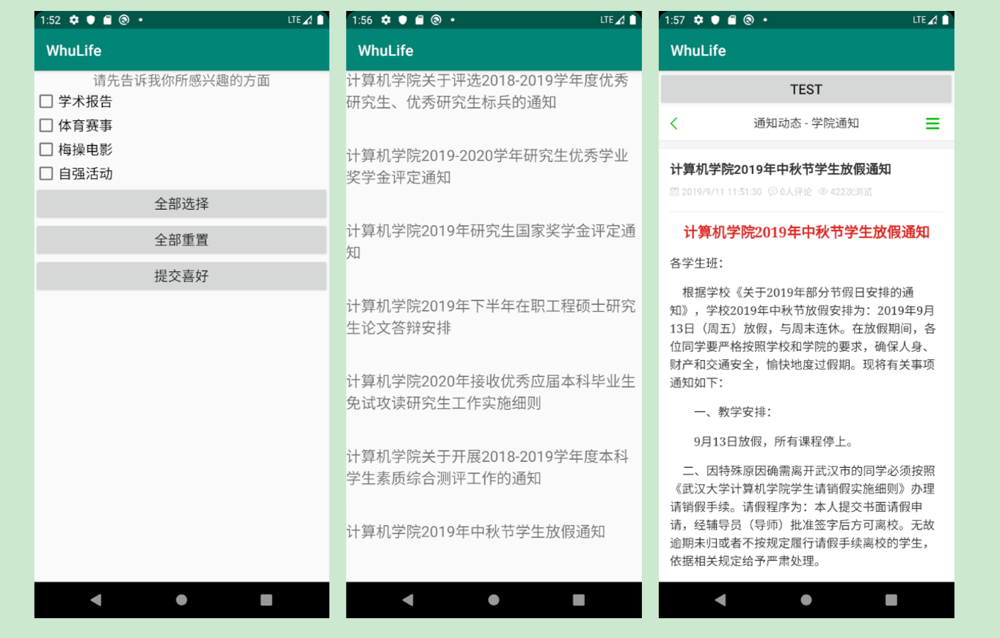

# 设计文档

## 1. 开发规划

### 1.1 开发人员

|模块分组|开发人员|
|-------|--------|
|课程及考试信息获取|伍晶晶 姜星宇|
|地点定位及快递提醒|徐嘉坤 马润|
|推送及兴趣备忘模块|康楷晨 胡凯迪|
|UI设计小组和客户|李王晨 李凌威（客户）|

### 1.2 开发环境和工具

- Windows系统
- Android Studio集成开发环境
- GitHub团队项目管理
- Java语言

### 1.3 项目开发进度概述

- 主体UI设计过半风格还有待统一
- 课程内容获取已实现
- 地点定位模块已实现
- 快递提醒信息已实现
- 推送信息模块已实现
- 兴趣备忘录选择模块已实现

---------------------

## 2. 总体设计

### 2.1 基本设计描述

1. 直接导入的可提醒项目有：

- 上课地点的课程信息
需要教务系统权限以及时间信息，上课提前按时间信息通知，位置接近后可以提醒上课教室，后期可以考虑按专业基于当前位置推荐其他课程的应用-蹭课小助手。

2. 自主添加的信息提醒：

- 快递地点的提醒服务
时间和地点信息提醒需要进行双重考虑，确保人性化提醒，防止由于宿舍和快递点过近造成的不断提醒，也防止离快递点过远造成的不能提醒；并且最后希望加入提醒级别，比如第一次振动或全屏窗提醒，用户可以设置稍后提醒，随后只是挂在通知栏内防止一致打扰用户。
- 考试信息
考虑需要提前提醒 基于时间 地点有点不考虑实际情况。
- 自主订阅服务
相关讲座、梅操电影、体育比赛等。

### 2.2 系统层次图

- 顶层系统结构图
 
- 系统拉取提醒信息模块
 
- 快递信息提醒模块
 
- 自主订阅模块
 

### 2.3 系统数据流图

- 系统拉取提醒信息模块数据流图
 
- 快递信息提醒模块数据流图
 
- 自主订阅模块数据流图
 

### 2.4 系统流程图

- 用户课程信息获取系统流程图
  

- 快递模块系统流程图
  

### 2.5 主要界面功能流程描述

- 登录界面
 

1. 用户可以进行APP的登录

2. 用户可以阅读本APP的权限使用等相关信息

-------------------

- 跳转界面
   
  

1. 用户可以通过该界面跳转进入我们的各项服务
2. 用户可以进行相关个性化的设置

-----------------

- 课程内容获取数据库相关情况
  
  
  

1. 用户可以根据自己的教务系统账号和密码进行课程内容的同步，数据将备份到本机中以备使用

--------------

- 定位信息获取及提醒事件添加
  
  
  

1. 用户可以在此服务界面中允许定位功能之后，我们可以及时根据用户的地点信息进行提醒服务
2. 用户可以根据我们预先设计的快递备忘事项进行选择，以个性化的生成备忘事件，自动用于后期提醒

- 订阅推送模块
  
  
  
  

1. 用户首次进入该模块的时候需要进行兴趣设置，我们会将用户的喜好存储在SharedPreference中，方便后期推送
2. 用户可以进入新闻推送页面，我们会按照用户设置的喜好进行新闻推送
3. 用户可以重新设置兴趣，以便让我们推送新的方向
4. 用户可以在我们为用户按兴趣设置的候选备忘事件中设置相关备忘事项

## 3. 数据描述

1. 用户教务系统登录信息

| 字段名   | 数据类型 | 长度 | 主键 | 非空 | 描述     |
| -------- | -------- | ---- | ---- | ---- | -------- |
| Sno      | VARCHAR  | 20   | 是   | 是   | 用户学号 |
| Password | VARCHAR  | 20   | 否   | 是   | 密码     |

2. 教务系统信息

| 字段名     | 数据类型 | 长度 | 主键 | 非空 | 描述         |
| ---------- | -------- | ---- | ---- | ---- | ------------ |
| Sno        | VARCHAR  | 20   | 是   | 是   | 用户学号     |
| Cno        | VARCHAR  | 20   | 是   | 是   | 课程编号     |
| Cname      | VARCHAR  | 30   | 否   | 是   | 课程名称     |
| Ctime      | DATETIME | 8    | 否   | 是   | 课程时间     |
| CLongitude | FLOAT    | 4    | 否   | 是   | 教学地点经度 |
| CLatitude  | FLOAT    | 4    | 否   | 是   | 教学地点纬度 |
| Croom      | VARCHAR  | 20   | 否   | 是   | 课程教室     |

3. 快递提醒相关信息

| 字段名     | 数据类型 | 长度 | 主键 | 非空 | 描述                     |
| ---------- | -------- | ---- | ---- | ---- | ------------------------ |
| Eno        | VARCHAR  | 15   | 是   | 是   | 快递取件码便于你轻松取件 |
| ELongitude | FLOAT    | 4    | 否   | 是   | 快递点经度               |
| ELatitude  | FLOAT    | 4    | 否   | 是   | 快递点纬度               |
| Etime      | DATETIME | 8    | 否   | 是   | 时间信息                 |
| Etype      | VARCHAR  | 20   | 否   | 是   | 快递类型                 |
| Emessage   | VARCHAR  | 50   | 否   | 是   | 相关备忘信息             |

4. 待办事项

| 字段名     | 数据类型  | 长度 | 主键 | 非空 | 描述                                 |
| ---------- | --------- | ---- | ---- | ---- | ------------------------------------ |
| Pid        | INTEGER   | 4    | 是   | 是   | 提醒计划的唯一标识号                 |
| Ptime      | TIMESTAMP | 4    | 否   | 否   | 待办事项的时间                       |
| PLongitude | FLOAT     | 4    | 否   | 否   | 待办事项的地点经度                   |
| PLatitude  | FLOAT     | 4    | 否   | 否   | 待办事项的地点纬度                   |
| PPush      | VARCHAR   | 60   | 否   | 是   | 提醒时的弹窗信息                     |
| PInfo      | VARCHAR   | 200  | 否   | 是   | 详细的事项描述                       |
| PStatus    | VARCHAR   | 10   | 否   | 是   | 事项的状态, [未添加\|待提醒\|已处理] |
| PTimes     | SMALLINT  | 2    | 否   | 是   | 已经提醒的次数       

## 4. 接口规范

### 4.1 主要接口内容说明

- 基于时间的提醒服务
- 基于地点的提醒服务

本APP主要功能的实现是将用户所添加的待提醒时间添加到一个提醒队列中，根据时间和地点信息将待提醒内容送入相应的提醒服务中，让手机进行提醒服务。
基于时间的提醒服务主要参数是当前时间信息、备忘录时间信息、备忘录主要事件内容等。
基于地点的提醒服务主要的参数是当前的地点信息、备忘录的经度、纬度信息以及备忘录主要事件内容等。

## 5. 主要函数说明

